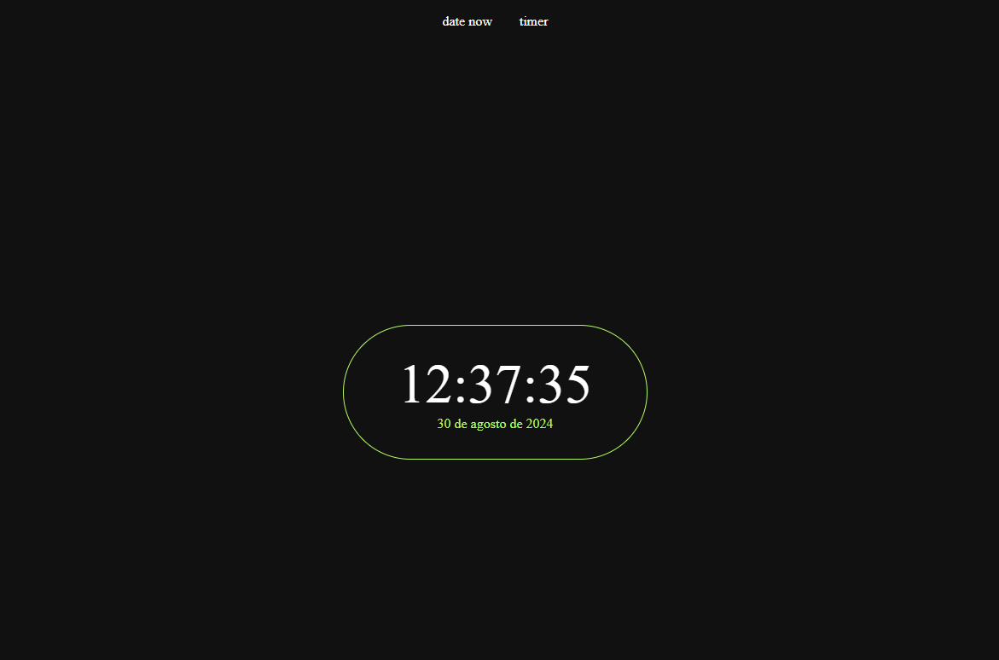

<h1 align="center"> MyTime </h1>

  <a href="#-tecnologias">Tecnologias</a>&nbsp;&nbsp;&nbsp;|&nbsp;&nbsp;&nbsp;
  <a href="#-projeto">Projeto</a>&nbsp;&nbsp;&nbsp;

 

  

## 🚀 Tecnologias

Esse projeto foi desenvolvido com as seguintes tecnologias:

- HTML e CSS
- JavaScript
- Git e Github

## 💻 Projeto

O MyTime é um Timer online que apresenta em tempo real a data e hora, além de disponibilizar de um counter.

Acesse através do lik: https://abreuitalo.github.io/mytime/

---
